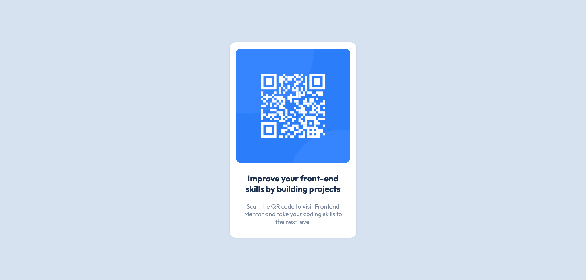

# Frontend Mentor - QR code component solution

This is a solution to the [QR code component challenge on Frontend Mentor](https://www.frontendmentor.io/challenges/qr-code-component-iux_sIO_H). Frontend Mentor challenges help you improve your coding skills by building realistic projects.

## Table of contents

- [Overview](#overview)
  - [Screenshot](#screenshot)
  - [Links](#links)
- [My process](#my-process)
  - [Built with](#built-with)
  - [What I learned](#what-i-learned)
  - [Continued development](#continued-development)
  - [Useful resources](#useful-resources)
- [Author](#author)
- [Acknowledgments](#acknowledgments)

**Note: Delete this note and update the table of contents based on what sections you keep.**

## Overview

### Screenshot

### Links

- Solution URL: [HTML](https://github.com/ctspecht12/FM-qr-code-component-solution/blob/23ec0e1f3c86bb649b055f11ff0c3662df725225/index.html)
- Solution URL: [CSS](https://github.com/ctspecht12/FM-qr-code-component-solution/blob/23ec0e1f3c86bb649b055f11ff0c3662df725225/css/styles.css)
- Live Site URL: [Add live site URL here](https://ctspecht12.github.io/FM-qr-code-component-solution/)

## My process

First I created a folder with all the files I'd need (images, html, css). Then I got those all set up (linking css to html, adding google fonts, pulling styles from the style-guide, etc.). I wrote the HTML first and the started figuring out how to code the CSS

### Built with

- HTML5
- CSS
- Flexbox

### What I learned

The main challenge I had was centering the card vertically. I experimented with a couple different solutions, but ultimately, I ended up making it a flexbox so that I could just the justify-content property.

### Continued development

I'm still fairly uncomfortable with flexbox and css grid, so I hope to get more experienced with them in the future.

## Author

- Website - [Christopher Specht](https://ctspecht12.github.io/mysite/)
- Frontend Mentor - [@ctspecht12](https://www.frontendmentor.io/profile/ctspecht12)
